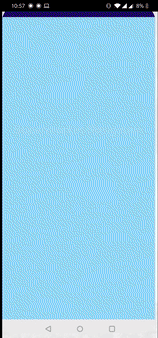

## SuperMarket-Navigation-User-App

<h3 style="text-align=center";font-family: "Robot Mono", Times, serif; >"A modern approach towards traditional shopping experience"</h3>

<h4 style="text-align=center";font-family: "Robot Mono", Times, serif; padding :60px >This App is a part of my final year project which simulates as an online shopping SuperStore with store categpry such as Groccery, Clothing and Electronics."</h4>

<h4 style="text-align=center";font-family: "Robot Mono", Times, serif; padding :60px >The Authentication is done using fAuth and is stored inside firestore.</h4>
<a href>https://firebase.google.com/docs/auth/android/firebaseui?authuser=2</a>

<h5 style="text-align=center";font-family: "Times New Roman", Times, serif; padding: 40px>User login along with the dashboard which contains a gist of modules implemented in this app</h5>

  

<h5 style="text-align=center";font-family: "Times New Roman", Times, serif; padding:40px >All the items selected by the user is stored inside the realtime database which is fetched and displayed inside the cart function</h5>

  

<h4 style="text-align=center";font-family: "Robot Mono", Times, serif; padding :60px >Created an admin panel to add data inside out firebase realtime database which is then fetched inside our app and displayed in a recylerview </h4>

<h4 style="text-align=center";font-family: "Robot Mono", Times, serif; padding :60px >when the user selects any items with the help of current user's unique hash id a temporary child is created and all the choosen cart items are stored and can be easily removed by the user. </h4>

