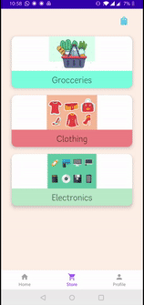

## SuperMarket-Navigation-User-App

<h3 style="text-align=center";font-family: "Times New Roman", Times, serif; >"A modern approach towards traditional shopping experience"</h3>

<h5 style="text-align=center";font-family: "Times New Roman", Times, serif; padding: 40px>User login along with the dashboard which contains a gist of modules implemented in this app</h5>

  

<h5 style="text-align=center";font-family: "Times New Roman", Times, serif; padding:40px >All the items selected by the user is stored inside the realtime database which is fetched and displayed inside a recylerview in the cart function</h5>

  

